# Aldrin DEX SDK

  

[](https://github.com/aldrin-exchange/aldrin-sdk/blob/main/LICENSE)

  

<p  align="center">

  


  

</p>

  

<p  align="center">

  

[<a  href="https://dex.aldrin.com">Website</a> | <a  href="https://github.com/aldrin-exchange/aldrin-sdk/tree/main/docs">API Reference</a> | <a  href="https://github.com/aldrin-exchange/aldrin-sdk/tree/main/examples">Examples</a> ]

  

</p>

  

## Getting Started

  

1. Install one of available [Solana wallets](https://docs.solana.com/wallet-guide)

  

2. Install library with `npm install @aldrin_exchange/sdk` or `yarn add @aldrin_exchange/sdk`

  

3. Check [Usage](#usage) section or take a look at [examples](https://github.com/aldrin-exchange/aldrin-sdk/tree/main/examples) and [API reference](https://github.com/aldrin-exchange/aldrin-sdk/tree/main/docs)

  

## Usage

  


  

## Start

  

Import usefull stuff 🤩

  

```js

import { Wallet } from  "@project-serum/anchor";

import { PublicKey } from  "@solana/web3.js";

import  BN  from  "bn.js";

import { TokenSwap } from  "../../src";

```

  

Initialize Wallet 💰

  

```js

const  wallet = Wallet.local(); // Or any other solana wallet

```

  

## Swap

```mermaid

  

graph TD

  

B(Swap)

  

B --> |Check tokens prices| E

B --> |Trade| F

B --> |Сheck impact| G

  

E(tokenSwap.getPrice)

F(tokenSwap.swap)

G(tokenSwap.getSwapImpact)

```

  



  

### Swap tokens

  

1. Initialize the program 💾

  

```js

const  tokenSwap = await  TokenSwap.initialize();

```

  

2. Choosing token mints 📟

  

```js

const  rin = new  PublicKey("E5ndSkaB17Dm7CsD22dvcjfrYSDLCxFcMd6z8ddCk5wp");

  

const  usdc = new  PublicKey("EPjFWdd5AufqSSqeM2qN1xzybapC8G4wEGGkZwyTDt1v");

```

  

3. Create Swap transaction 🪄

  

```js

const  transactionId = await  tokenSwap.swap({

	wallet:  wallet,

	// A least 1 of parameters minIncomeAmount/outcomeAmount is required

	minIncomeAmount:  new  BN(1_000_000_000), // 1 RIN

	// outcomeAmount: new BN(5_000_000) // 5 USDC

	mintFrom:  usdc,

	mintTo:  rin,

});

```

  

### Additional

  

Check tokens prices 🌘

  

```js

const  rinPrice = await  tokenSwap.getPrice({ mintFrom:  rin, mintTo:  usdc });

  

const  usdRinPrice = await  tokenSwap.getPrice({ mintFrom:  usdc, mintTo:  rin });

```

  

---

  

Check swap impact 🏋️‍♀️

  

```js

const  swapImpact = await  tokenSwap.getSwapImpact({

	wallet,

	minIncomeAmount:  new  BN(1_000_000_000), // 1 RIN

	mintFrom:  usdc,

	mintTo:  rin,

});

```

  

## [Pool](https://dex.aldrin.com/pools) 🏊‍♂️

  


  

Import existing pools 🍀

  

```js

import { AUTHORIZED_POOLS } from  "../../src";

```

  

---

  

### Add pool liquidity 🏒

  

Deposit transaction 🪄

  

```js

const  transactionId = await  tokenSwap.depositLiquidity({

	wallet:  wallet,

	poolMint:  AUTHORIZED_POOLS.RIN_USDC.poolMint,

	// A least 1 of parameters maxBase/maxQuote is required

	// maxBase: new BN(1_000_000_000), // 1 RIN

	maxQuote:  new  BN(5_000_000), // 5 USDC

});

```

  

---

  

### Withdraw liquidity from pool 🤸‍♀️

  

Withdraw transaction 🎢

  

```js

const  transactionId = await  tokenSwap.withdrawLiquidity({

	wallet:  wallet,

	poolMint:  AUTHORIZED_POOLS.RIN_USDC.poolMint,

	poolTokenAmount:  new  BN(100_000), // LP tokens

	// A least 1 of parameters minBase/minQuote is required

	minBase:  new  BN(1_000_000), // 1 RIN

	// minQuote: new BN(5_000_000), // 1 RIN

});

```

  

## Farm 👩‍🌾

  


  

### Check farming rewards🥕

  

```js

const  farmed = await  tokenSwap.getFarmed({

	wallet,

	poolMint:  AUTHORIZED_POOLS.SOL_USDC.poolMint,

});

  

farmed.forEach((f) => {

	console.log(

	`Reward for farming: mint ${f.tokenInfo.mint.toBase58()}, amount: ${f.calcAccount.tokenAmount.toString()}`

	);

});

```

  

---

  

You can find more complex examples by [link](https://github.com/aldrin-exchange/aldrin-sdk/tree/main/examples).

  

## Development 🛠

  

1. Clone [repository](https://github.com/aldrin-exchange/aldrin-sdk)

  

2. Run `yarn` or `npm install`

  

## Warning 🚧

  

The library is under active development. Use it at your own risk.